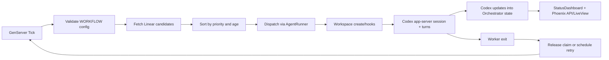
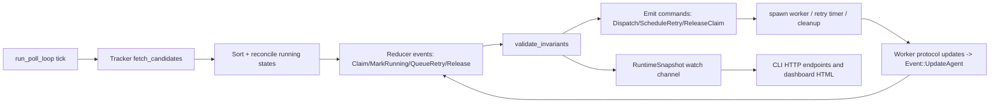

# Symphony Project Atlas

_Last updated: 2026-03-05_

## 1) Project Identity

Symphony is an autonomous orchestration service that turns tracker issues (currently Linear) into isolated, unattended coding-agent runs.

This monorepo intentionally contains two implementations:

| Implementation | Status | Purpose |
| --- | --- | --- |
| `elixir/` | stable reference runtime | Production-oriented reference behavior with OTP supervision + Phoenix observability. |
| `rust/` | redesign in progress | Reducer-first runtime with stronger formal correctness posture and modular crate boundaries. |

The authoritative behavior contract is [`SPEC.md`](./SPEC.md).

## 2) Source-of-Truth Hierarchy

| Priority | Artifact | Why it matters |
| --- | --- | --- |
| 1 | [`SPEC.md`](./SPEC.md) | Language-agnostic orchestrator contract (state machine, safety, retries, workspace rules, agent/tracker protocols). |
| 2 | [`elixir/WORKFLOW.md`](./elixir/WORKFLOW.md) | In-repo runtime contract (front matter config + prompt body). |
| 3 | [`elixir/README.md`](./elixir/README.md), [`rust/README.md`](./rust/README.md) | Implementation-level operational docs. |
| 4 | `TASKS.md` files under `rust/` | Delivery/maturity map for crate-level, test-level, proof-level, and docs-level completion. |

## 3) Topology Map

```text
symphony/
├── SPEC.md
├── README.md
├── AGENTS.md
├── .github/workflows/
│   ├── make-all.yml
│   ├── pr-description-lint.yml
│   ├── rust-ci.yml
│   └── rust-proofs.yml
├── elixir/
│   ├── lib/
│   │   ├── symphony_elixir/            # orchestration/runtime modules
│   │   ├── symphony_elixir_web/        # Phoenix dashboard/API
│   │   └── mix/tasks/                  # repo quality tasks
│   ├── test/                           # ExUnit suites + snapshot fixtures
│   ├── config/
│   ├── WORKFLOW.md
│   └── AGENTS.md
├── rust/
│   ├── crates/                         # 12 focused crates
│   ├── tests/                          # conformance/interleavings/soak programs
│   ├── proofs/verus/                   # formal proofs + proof scripts
│   ├── docs/architecture + docs/adr
│   └── TASKS.md + child TASKS
└── scripts/opencode/                   # high-parallel task fanout helpers
```

## 4) System Contract (Spec-Level)

`SPEC.md` defines the full service surface, including:

- Domain entities: Issue, Workflow Definition, Runtime Config, Workspace, Run Attempt, Retry Entry, Runtime State.
- Workflow contract: front matter schema + prompt template rendering rules.
- Orchestrator state machine: claim/run/retry/release lifecycle and invariants.
- Polling and scheduling: candidate selection, concurrency control, reconciliation, startup cleanup.
- Agent protocol: app-server launch, thread/turn handshake, streaming event semantics, tool approvals.
- Tracker contract: Linear-compatible query and write behavior.
- Workspace safety: root containment, hooks lifecycle, cleanup guarantees.
- Observability: status/dashboard + JSON API behavior.
- Failure/security model: idempotency, recovery classes, trust boundaries.

## 5) Runtime Flows

### 5.1 Elixir Runtime Flow



### 5.2 Rust Runtime Flow



## 6) Elixir Implementation Deep Map

### 6.1 OTP Supervision Tree

`SymphonyElixir.Application` starts:

1. `Phoenix.PubSub` (`SymphonyElixir.PubSub`)
2. `Task.Supervisor` (`SymphonyElixir.TaskSupervisor`)
3. `SymphonyElixir.WorkflowStore`
4. `SymphonyElixir.Orchestrator`
5. `SymphonyElixir.HttpServer`
6. `SymphonyElixir.StatusDashboard`

### 6.2 Core Runtime Modules

| Module | File | Role |
| --- | --- | --- |
| `SymphonyElixir.Orchestrator` | [`elixir/lib/symphony_elixir/orchestrator.ex`](./elixir/lib/symphony_elixir/orchestrator.ex) | Poll loop, candidate selection, dispatch, reconciliation, stall detection, retry queue, snapshot API, token/rate-limit accounting. |
| `SymphonyElixir.AgentRunner` | [`elixir/lib/symphony_elixir/agent_runner.ex`](./elixir/lib/symphony_elixir/agent_runner.ex) | Single-issue execution, multi-turn continuation logic (`agent.max_turns`), issue-state refresh gate between turns. |
| `SymphonyElixir.Codex.AppServer` | [`elixir/lib/symphony_elixir/codex/app_server.ex`](./elixir/lib/symphony_elixir/codex/app_server.ex) | JSON-RPC stdio client for app-server handshake, turn streaming, approvals, tool calls, input-required handling. |
| `SymphonyElixir.Workspace` | [`elixir/lib/symphony_elixir/workspace.ex`](./elixir/lib/symphony_elixir/workspace.ex) | Per-issue workspace lifecycle, root/symlink safety checks, hook execution (`after_create`, `before_run`, `after_run`, `before_remove`). |
| `SymphonyElixir.Config` | [`elixir/lib/symphony_elixir/config.ex`](./elixir/lib/symphony_elixir/config.ex) | `WORKFLOW.md` front matter parsing + defaulting + validation + env/path resolution + codex sandbox policies. |
| `SymphonyElixir.Workflow` | [`elixir/lib/symphony_elixir/workflow.ex`](./elixir/lib/symphony_elixir/workflow.ex) | Front matter/body parsing from `WORKFLOW.md`. |
| `SymphonyElixir.WorkflowStore` | [`elixir/lib/symphony_elixir/workflow_store.ex`](./elixir/lib/symphony_elixir/workflow_store.ex) | Last-known-good workflow cache with periodic reload and retained-on-error behavior. |
| `SymphonyElixir.PromptBuilder` | [`elixir/lib/symphony_elixir/prompt_builder.ex`](./elixir/lib/symphony_elixir/prompt_builder.ex) | Solid template rendering for issue + attempt context. |
| `SymphonyElixir.Tracker` | [`elixir/lib/symphony_elixir/tracker.ex`](./elixir/lib/symphony_elixir/tracker.ex) | Tracker boundary switching (`linear` vs `memory`). |
| `SymphonyElixir.Linear.*` | [`elixir/lib/symphony_elixir/linear/client.ex`](./elixir/lib/symphony_elixir/linear/client.ex) | Linear GraphQL querying, pagination, normalization, assignee routing, state writes. |

### 6.3 Dynamic Tool Surface

`SymphonyElixir.Codex.DynamicTool` currently exposes one tool:

- `linear_graphql`: raw GraphQL against Linear with typed schema + structured success/failure payloads.

This is injected into app-server `thread/start` dynamic tools so skills can call tracker operations directly.

### 6.4 Config/Posture Details

Key defaults in Elixir config:

- Poll interval: 30s
- Max concurrent agents: 10
- Max turns per run: 20
- Retry backoff max: 300s
- Codex command: `codex app-server`
- Turn timeout: 1h
- Read timeout: 5s
- Stall timeout: 5m
- Default thread sandbox: `workspace-write`
- Default turn policy: `workspaceWrite` with writable root set to workspace

Security/safety posture:

- Worker cwd must be inside configured workspace root.
- Workspace root itself cannot be used as worker cwd.
- Symlink escape checks for workspace paths.
- Safer default approval policy rejects sandbox/rules/mcp elicitations unless configured.

### 6.5 Observability Stack

| Surface | File(s) | Contract |
| --- | --- | --- |
| Terminal dashboard | [`elixir/lib/symphony_elixir/status_dashboard.ex`](./elixir/lib/symphony_elixir/status_dashboard.ex) | Live TUI-style status including running issues, retry queue, token throughput graph, rate limits, event humanization. |
| HTTP server bootstrap | [`elixir/lib/symphony_elixir/http_server.ex`](./elixir/lib/symphony_elixir/http_server.ex) | Starts Phoenix endpoint when `server.port` is present or `--port` override is provided. |
| LiveView dashboard | [`elixir/lib/symphony_elixir_web/live/dashboard_live.ex`](./elixir/lib/symphony_elixir_web/live/dashboard_live.ex) | Browser dashboard with running/retrying/tokens/rate-limit views. |
| JSON API | [`elixir/lib/symphony_elixir_web/controllers/observability_api_controller.ex`](./elixir/lib/symphony_elixir_web/controllers/observability_api_controller.ex) | `/api/v1/state`, `/api/v1/<issue_identifier>`, `/api/v1/refresh`. |

### 6.6 Elixir Entry/Tooling

| Entry/Task | File |
| --- | --- |
| CLI/escript entry | [`elixir/lib/symphony_elixir/cli.ex`](./elixir/lib/symphony_elixir/cli.ex) |
| PR body lint Mix task | [`elixir/lib/mix/tasks/pr_body.check.ex`](./elixir/lib/mix/tasks/pr_body.check.ex) |
| Public spec checker | [`elixir/lib/mix/tasks/specs.check.ex`](./elixir/lib/mix/tasks/specs.check.ex) |
| Workspace cleanup helper | [`elixir/lib/mix/tasks/workspace.before_remove.ex`](./elixir/lib/mix/tasks/workspace.before_remove.ex) |

### 6.7 Elixir Test Coverage Shape

Test suites emphasize:

- Orchestrator dispatch/retry/reconcile behavior.
- Workspace safety and hook behavior.
- App-server protocol corner cases (approval/input/tool calls/partial lines).
- Dashboard snapshot rendering and event humanization.
- Config/workflow parsing correctness.
- CLI and Mix task guardrails.

Key files:

- [`elixir/test/symphony_elixir/core_test.exs`](./elixir/test/symphony_elixir/core_test.exs)
- [`elixir/test/symphony_elixir/app_server_test.exs`](./elixir/test/symphony_elixir/app_server_test.exs)
- [`elixir/test/symphony_elixir/orchestrator_status_test.exs`](./elixir/test/symphony_elixir/orchestrator_status_test.exs)
- [`elixir/test/symphony_elixir/workspace_and_config_test.exs`](./elixir/test/symphony_elixir/workspace_and_config_test.exs)

## 7) Rust Implementation Deep Map

### 7.1 Crate Architecture

| Crate | Responsibility |
| --- | --- |
| `symphony-domain` | Pure reducer and invariant model (`Event`, `Command`, `reduce`, `validate_invariants`). |
| `symphony-runtime` | Async orchestration loop, dispatch/retry scheduling, worker lifecycle, reconciliation, snapshot publishing. |
| `symphony-config` | Typed runtime config model + YAML front matter loader + validation + CLI override application. |
| `symphony-workflow` | `WORKFLOW.md` parser and hot-reload utility with change stamps and retained-last-good semantics. |
| `symphony-tracker` | Tracker trait contracts and shared issue/state/error types. |
| `symphony-tracker-linear` | Linear GraphQL implementation for tracker trait. |
| `symphony-workspace` | Workspace root containment, key sanitization, hook lifecycle, and remove semantics. |
| `symphony-agent-protocol` | App-server protocol parsing, method normalization, startup payload builders, sequence validation, policy classification. |
| `symphony-observability` | Runtime/issue/state snapshot models and sanitization helpers. |
| `symphony-http` | Route handlers and API/HTML response projections from snapshots. |
| `symphony-cli` | Process entrypoint, workflow/config reload loop, runtime launch, optional HTTP service, graceful shutdown. |
| `symphony-testkit` | Deterministic fakes/builders/schedulers/trace utilities reused by suites. |

### 7.2 Domain State Machine (Reducer Core)

`OrchestratorState` tracks:

- `claimed`
- `running`
- `retry_attempts`
- `codex_totals`

Events:

- `Claim`
- `MarkRunning`
- `UpdateAgent`
- `QueueRetry`
- `Release`

Commands:

- `Dispatch`
- `ScheduleRetry`
- `ReleaseClaim`
- `TransitionRejected`

Invariants:

- running implies claimed.
- retry entries imply claimed.
- running and retry cannot coexist for same issue.
- retry attempts are always positive.

### 7.3 Runtime Loop Details

`Runtime::run_tick` performs:

1. Candidate fetch + deterministic sort (priority, created_at, identifier).
2. Stall detection from last-seen timestamps.
3. Running-issue tracker-state reconciliation (terminal and non-active releases).
4. Stale-claim reconciliation.
5. Slot-enforced dispatch with per-state limits.
6. Invariant validation and snapshot publication.

`Runtime::run_poll_loop` adds:

- periodic ticks,
- immediate refresh channel,
- config version hot-reload,
- graceful shutdown with worker/retry task abort.

### 7.4 Worker Lifecycle and Protocol Behavior

`ShellWorkerLauncher`:

- prepares workspace with hooks,
- renders prompt from template,
- launches codex command,
- executes startup handshake when `app-server` mode is detected,
- monitors stdout/stderr protocol stream,
- maps policy outcomes:
  - input-required/approval-required -> permanent failure,
  - timeout/cancelled classes -> retryable failure,
- replies `unsupported_tool_call` for tool-call requests without hard-failing session.

### 7.5 Config and Workflow Semantics

`RuntimeConfig` sections mirror spec contract:

- `tracker`, `polling`, `workspace`, `hooks`, `agent`, `codex`, `log`, `server`, `version`.

Loader features:

- env indirection (`$VAR`, `${VAR}`),
- state-name normalization,
- state-specific concurrency limits,
- strict typed validation and explicit errors,
- CLI overrides with validation and precedence over file/env values.

Workflow crate features:

- front matter parsing with strict map requirement,
- non-empty prompt body enforcement,
- hot reload with change stamps,
- retained-last-good behavior on reload parse failure.

### 7.6 Tracker/Workspace Boundaries

Tracker contract supports:

- candidate fetch,
- state-by-id fetch,
- terminal candidate/state helpers,
- typed error taxonomy.

Workspace crate enforces:

- sanitized issue key,
- root containment,
- worker cwd containment,
- lifecycle hooks with timeout/truncation,
- before-remove hook path.

### 7.7 Observability + HTTP

`RuntimeSnapshot` currently exposes running/retrying counts (plus default spec view placeholders for totals/rate limits).

HTTP crate serves:

- `GET /` (HTML dashboard),
- `GET /api/v1/state`,
- `GET /api/v1/<issue_identifier>`,
- `POST /api/v1/refresh`.

CLI builds `StateSnapshot` by combining runtime state with tracker-backed issue metadata.

### 7.8 Rust Test Programs

| Program | Path | Purpose |
| --- | --- | --- |
| Conformance | [`rust/tests/conformance`](./rust/tests/conformance) | SPEC-aligned behavior checks across domains/crates. |
| Interleavings | [`rust/tests/interleavings`](./rust/tests/interleavings) | Deterministic schedule-order race/interleaving checks. |
| Soak | [`rust/tests/soak`](./rust/tests/soak) | Bounded long-run stress patterns. |

### 7.9 Formal Verification Program

Proof modules under [`rust/proofs/verus/specs`](./rust/proofs/verus/specs):

- `runtime_quick.rs`: core invariant preservation.
- `runtime_full.rs`: transition-chain properties.
- `session_liveness.rs`: one-step liveness obligations.
- `workspace_safety.rs`: key/path containment model.

Proof scripts:

- [`run-proof-checks.sh`](./rust/proofs/verus/scripts/run-proof-checks.sh) (`quick`/`full` profiles).
- [`install-verus.sh`](./rust/proofs/verus/scripts/install-verus.sh).
- [`run-long-suite.sh`](./rust/proofs/verus/scripts/run-long-suite.sh) (currently placeholder execution plan printer).

## 8) CI and Quality Gates

| Workflow | Main checks |
| --- | --- |
| `make-all.yml` | Elixir `make all` gate. |
| `pr-description-lint.yml` | PR body format validation via `mix pr_body.check`. |
| `rust-ci.yml` | `cargo fmt --check`, `cargo clippy -D warnings`, `cargo test --workspace`, suite gates for conformance/interleavings/soak. |
| `rust-proofs.yml` | Verus install + guide snapshot verification + proof checks + scheduled long-suite placeholders. |

## 9) Delivery/Maturity Snapshot (Rust TASKS program)

### 9.1 Program-Level Snapshot from Task Docs

- `rust/TASKS.md` reports **79%** completion (2026-03-05).
- Major implemented areas: reducer/runtime skeleton, config/workflow/workspace, tracker/protocol/http/cli scaffolding, conformance matrix, CI wiring, proof pipeline bootstrap.
- Major remaining areas: deeper interleavings/soak depth, final observability parity, full proof closure, operational runbooks/cutover readiness.

### 9.2 Checkbox Rollup (Observed)

| Task File | Total | Checked | Open |
| --- | ---: | ---: | ---: |
| `rust/TASKS.md` | 33 | 20 | 13 |
| `rust/crates/symphony-runtime/TASKS.md` | 19 | 18 | 1 |
| `rust/crates/symphony-observability/TASKS.md` | 11 | 3 | 8 |
| `rust/crates/symphony-testkit/TASKS.md` | 10 | 0 | 10 |
| `rust/tests/TASKS.md` | 8 | 2 | 6 |
| `rust/proofs/TASKS.md` | 8 | 1 | 7 |
| `rust/docs/TASKS.md` | 14 | 0 | 14 |

## 10) Operational Scripts and Aux Tooling

`./scripts/opencode/` provides high-parallel task fanout utilities for `opencode` worktree-based batch execution with provider/model fallback.

Key files:

- [`scripts/opencode/fanout_retry.sh`](./scripts/opencode/fanout_retry.sh)
- [`scripts/opencode/install_agents.sh`](./scripts/opencode/install_agents.sh)
- [`scripts/opencode/model-map.env.example`](./scripts/opencode/model-map.env.example)

## 11) Engineer Navigation Guide

### 11.1 If you need reference behavior now

1. Start in [`elixir/`](./elixir/).
2. Read [`elixir/README.md`](./elixir/README.md) and [`elixir/WORKFLOW.md`](./elixir/WORKFLOW.md).
3. Trace runtime from `Orchestrator` -> `AgentRunner` -> `Codex.AppServer` -> `Workspace`.

### 11.2 If you are contributing to Rust redesign

1. Read [`rust/README.md`](./rust/README.md).
2. Read [`rust/docs/architecture/overview.md`](./rust/docs/architecture/overview.md) and ADRs in [`rust/docs/adr`](./rust/docs/adr).
3. Start from [`rust/crates/symphony-domain/src/lib.rs`](./rust/crates/symphony-domain/src/lib.rs), then [`rust/crates/symphony-runtime/src/lib.rs`](./rust/crates/symphony-runtime/src/lib.rs), then adapters.
4. Cross-check scope with crate `TASKS.md` before coding.

### 11.3 Canonical quality commands

```bash
# Elixir
cd elixir
make all

# Rust
cd rust
cargo fmt --all --check
cargo clippy --workspace --all-targets -- -D warnings
cargo test --workspace
```

## 12) Practical Summary

This repo is a dual-track orchestration platform:

- Elixir: richer, operational reference implementation with dashboard + broad behavioral coverage.
- Rust: structurally cleaner reducer-first architecture with explicit correctness and proof trajectory, still closing final parity and operations hardening.

