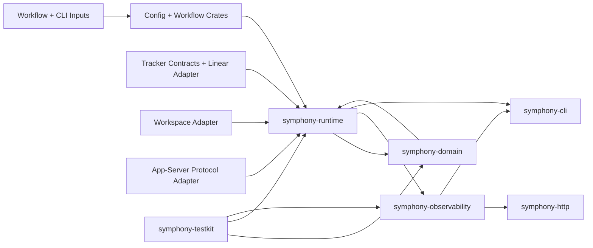

<!-- markdownlint-disable MD013 -->
# Symphony Rust Architecture Overview

Owner: Rust implementation maintainers
Last updated: 2026-03-06

This document is the source-of-truth architecture narrative for the Rust
orchestrator. It describes the current crate layering, runtime data flow,
state ownership, and recovery boundaries. Status, rollout readiness, and
remaining parity gaps belong in [../port-status.md](../port-status.md), not
here.

## Goals

The Rust implementation is built around four constraints:

1. Deterministic orchestration state transitions.
2. Clear adapter boundaries for tracker, workspace, and app-server IO.
3. Stable operator-visible read models.
4. Test and proof friendliness.

The architecture therefore keeps state mutation in pure reducer transitions and
pushes async, network, and subprocess work to explicit runtime/adapter layers.

## Topology

## Crate Layers

The workspace is intentionally layered.

| Layer | Crates | Responsibility |
| --- | --- | --- |
| Domain core | `symphony-domain` | Reducer transitions, invariants, command/event types. |
| Input contract | `symphony-config`, `symphony-workflow` | `WORKFLOW.md` parsing, typed config, CLI override application. |
| Adapter contracts | `symphony-tracker`, `symphony-workspace`, `symphony-agent-protocol` | Typed boundaries for tracker fetches, workspace lifecycle, and app-server streams. |
| Concrete adapters | `symphony-tracker-linear` | Linear GraphQL implementation of the tracker contract. |
| Runtime coordinator | `symphony-runtime` | Tick loop, dispatch, retry, reconciliation, worker lifecycle, snapshot publication. |
| Operator surfaces | `symphony-observability`, `symphony-http`, `symphony-cli` | Snapshot shaping, HTTP/dashboard serialization, and host wiring. |
| Validation support | `symphony-testkit` | Deterministic fakes, fixtures, clocks, and conformance helpers. |

See [dependencies.md](dependencies.md) for the dependency graph and layering
constraints.

## State Ownership

State ownership is strict.

| State | Owner | Mutation path |
| --- | --- | --- |
| `OrchestratorState` | `symphony-runtime` | Reducer events only. |
| Retry metadata and worker bookkeeping | `symphony-runtime` | Runtime internals around reducer-driven commands. |
| Runtime snapshots | `symphony-runtime` produces, `symphony-observability` shapes | Derived from runtime state and protocol updates. |
| HTTP state and dashboard output | `symphony-http` | Pure serialization of snapshot state. |
| Host supervision state | `symphony-cli` | Tokio task coordination and OS signal handling. |

Adapters do not mutate orchestration state directly.

## Runtime Data Flow

One poll/reconcile cycle follows this order:

1. `symphony-cli` builds the effective runtime config from the loaded workflow
   plus CLI overrides.
2. `symphony-runtime` starts a tick and fetches tracker facts through the
   `TrackerClient` trait.
3. Runtime-side eligibility logic normalizes candidates into reducer events and
   scheduled commands.
4. `symphony-domain` applies transitions and validates invariants before side
   effects execute.
5. `symphony-runtime` executes emitted commands:
   - spawn or reuse a worker session
   - queue retries
   - release stale claims
   - stop active workers when required
6. Protocol updates from the app-server feed back into running-entry metadata
   and observability fields.
7. `symphony-runtime` publishes a `RuntimeSnapshot`.
8. `symphony-http` and `symphony-cli` serve operator-visible state from that
   snapshot without re-querying the tracker for read paths.

## Worker Lifecycle

The runtime owns worker lifecycle end to end.

1. A dispatch command allocates attempt identity and workspace context.
2. `symphony-workspace` prepares the issue workspace and runs hooks.
3. `symphony-runtime::worker` launches the configured Codex/app-server command.
4. `symphony-agent-protocol` decodes stdout/stderr into typed protocol updates
   and policy outcomes.
5. Runtime updates the running entry with:
   - session/thread/turn identifiers
   - last protocol activity timestamp
   - token and rate-limit totals
   - summary text for operator surfaces
6. Terminal worker outcomes map to one of:
   - release claim
   - queue continuation retry
   - queue retryable failure backoff
   - record permanent failure diagnostics
7. Shutdown and reconciliation paths explicitly stop active worker tasks and
   clean runtime bookkeeping before releasing state.

## Observability Flow

Observability is snapshot-driven.

1. Runtime records poll timing, last activity, token totals, retry metadata,
   and rate-limit payloads.
2. `symphony-observability` shapes this into read-model structs that are safe
   for JSON and dashboard rendering.
3. `symphony-http` exposes:
   - `/api/v1/state`
   - `/api/v1/{issue_identifier}`
   - `/api/v1/refresh`
   - `/`
4. Degraded and stale states are represented explicitly rather than collapsing
   the HTTP surface.

The HTTP layer must remain a pure consumer of snapshot state. It must not
re-fetch tracker or worker facts to answer operator requests.

## Correctness Model

The runtime currently relies on these architectural invariants.

| ID | Invariant | Enforcement point |
| --- | --- | --- |
| INV-001 | `running ⊆ claimed` | `symphony-domain::validate_invariants` |
| INV-002 | `retry_attempts` are positive and monotonic per issue | Reducer rules plus runtime retry scheduling |
| INV-003 | Release clears claimed, running, retry, and worker bookkeeping for that issue | Reducer plus runtime cleanup path |
| INV-004 | Protocol/adapter failures do not mutate orchestration state except through explicit mapped events | Adapter boundary contract |
| INV-005 | HTTP and dashboard paths never require live tracker access | Snapshot-only operator surfaces |
| INV-006 | Worker cwd must stay within the configured workspace root | `symphony-workspace` safety validation |

## Failure Boundaries

Failures are classified by layer.

| Layer | Failure examples | Expected behavior |
| --- | --- | --- |
| Workflow/config | invalid front matter, bad override values | startup failure or retained-last-good reload |
| Tracker adapter | timeout, 4xx/5xx, malformed payloads | log and retry on next tick by policy |
| Workspace adapter | hook timeout, filesystem containment rejection | fail the worker launch cleanly without corrupting state |
| App-server protocol | malformed stdout, timeout, approval/input-required | map to typed worker outcomes and keep runtime alive |
| Runtime supervisor | stalled worker, background-task death | queue retry or fail host depending on ownership layer |
| Observability | snapshot timeout/unavailable | preserve stale state when available; never mutate orchestrator state |

## Host Responsibilities

`symphony-cli` owns host concerns that do not belong in the runtime crate:

- signal handling
- Tokio task supervision
- HTTP listener lifecycle
- workflow reload watching
- startup diagnostics
- exit-code mapping

Host-owned configuration changes, such as HTTP port or tracker auth changes,
are classified separately from runtime-safe reloads because they may require a
coordinated host restart instead of a live apply.

## Dependency Rules

The workspace follows these layering rules:

1. `symphony-domain` must not depend on runtime, HTTP, CLI, or concrete
   adapters.
2. Concrete adapters may depend on contract crates, but not on CLI or HTTP.
3. `symphony-runtime` may depend on contracts and concrete adapters selected by
   the host, but it must not depend on HTTP or CLI.
4. `symphony-http` consumes observability models only; it must not own runtime
   coordination.
5. `symphony-cli` is the outermost composition root.

## Current Non-Goals

These are intentionally outside this document’s scope:

- rollout readiness and cutover dates
- completion percentages
- detailed conformance matrix status
- temporary implementation bugs or regressions

Those belong in [../port-status.md](../port-status.md),
[../TASKS.md](../TASKS.md), and the suite-specific task maps.
